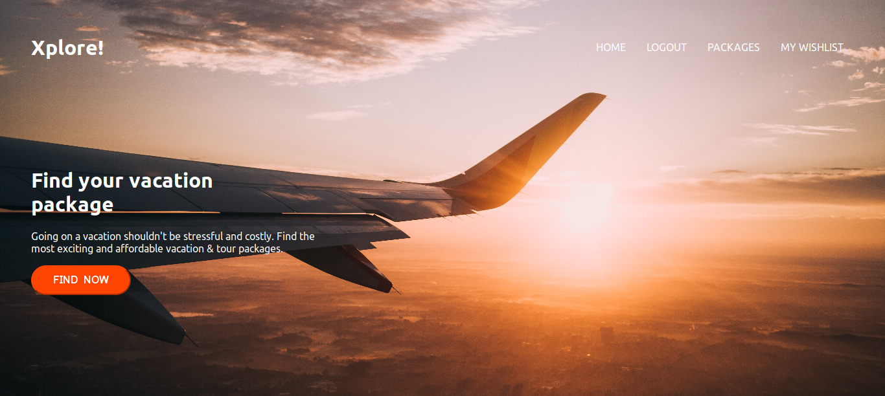

# Xplore

> A React & Redux App built to serve data from a Rails backend. Xplore lists travel packages and users can add packages to their wishlist.

## Built With

- React
- Redux

## Live Demo
[Click this Link](https://xplore-ng.herokuapp.com/)

## Getting Started

To get a local copy up and running follow these simple example steps.

### Prerequisites
 - Nodejs

### Setup & Install
- Clone this repository and cd into the project directory.
- Run `npm install` to install dependencies.
- Run `npm start` to start development server.
Localhost should open on your browser if all goes well.

### Usage
- To view a list of all packages, click the `PACKAGES` link.
- To add a package to your wishlist, you must be logged in.
- To login, click the `LOGIN` link. No Signup is required. Just enter your desired username.
- A proper authentication system is in development.
- To view your wishlist, click the `WISHLIST` link.

## Author

👤 **Moses Ogwo**

- Github: [@mosesogwo](https://github.com/mosesogwo/)
- Linkedin: [Moses Ogwo](https://www.linkedin.com/in/moses-ogwo-327168114/)

## 🤝 Contributing

Contributions, issues and feature requests are welcome!

Feel free to check the [issues page](issues/).

## Acknowledgments
- Design idea by [Alexey Savitskiy on Behance](https://www.behance.net/alexey_savitskiy)
- Other design idea from [Momondo](https://global.momondo.com/)
- Photo by [Charles Postiaux](https://unsplash.com/@charlpost?utm_source=unsplash&utm_medium=referral&utm_content=creditCopyText) on [Unsplash](https://unsplash.com/s/photos/london?utm_source=unsplash&utm_medium=referral&utm_content=creditCopyText)
- Photo by [Léonard Cotte](https://unsplash.com/@ettocl?utm_source=unsplash&utm_medium=referral&utm_content=creditCopyText) on [Unsplash](https://unsplash.com/s/photos/paris?utm_source=unsplash&utm_medium=referral&utm_content=creditCopyText)
- Photo by [David Rodrigo](https://unsplash.com/@david__r?utm_source=unsplash&utm_medium=referral&utm_content=creditCopyText) on [Unsplash](https://unsplash.com/s/photos/dubai?utm_source=unsplash&utm_medium=referral&utm_content=creditCopyText)
- Photo by [Darcey Beau](https://unsplash.com/@darceybeau?utm_source=unsplash&utm_medium=referral&utm_content=creditCopyText) on [Unsplash](https://unsplash.com/s/photos/dubai?utm_source=unsplash&utm_medium=referral&utm_content=creditCopyText)
- Photo by [Yeo Khee](https://unsplash.com/@yokeboy?utm_source=unsplash&utm_medium=referral&utm_content=creditCopyText) on [Unsplash](https://unsplash.com/s/photos/paris?utm_source=unsplash&utm_medium=referral&utm_content=creditCopyText)

## 📝 License

This project is [MIT](http://www.tldrlegal.com/license/mit-license) licensed.

